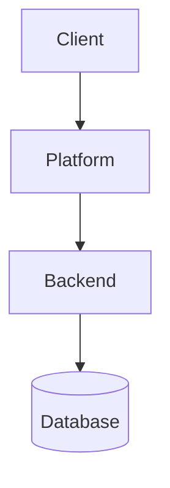

````instructions
# GitHub Copilot - Global Instructions (Centralized Session Management)

**Applies to:** All projects under Alex's workspace (6 workspaces)
**Priority:** HIGH  
**Last Updated:** March 27, 2026
**System:** Centralized session management and standards

---

## 0. Personal Planning Context

Before starting any session, check `.alex-copilot/context/` for current planning context:
- `priorities.md` -- current week's priorities and key dates
- `commitments.md` -- external commitments and delivery status
- `patterns.md` -- work patterns and reminders

When completing tasks, note any items relevant to weekly commitments or tracking in `.alex-copilot/sync/out/` so the planning layer stays current.

---

##  Mandatory Standards for All Documentation

### 1. Mermaid Diagram Generation Pattern

**CONTEXT-DEPENDENT APPROACH:**

The approach depends on the document's purpose and output format.

#### For Source Documentation (*.md in repositories):

1. **Generate PNG images** for each diagram using `renderMermaidDiagram` tool or equivalent
2. **Insert image reference ABOVE** each Mermaid code block:
   ```markdown
   
   
   ```mermaid
   graph TB
       A --> B
   ```
   ```

3. **Naming convention:** `<document-name>_diagram_<NN>.png` where NN is zero-padded (01, 02, etc.)
4. **Location:** Store PNG files in `diagrams/` subdirectory
5. **Keep Mermaid code:** Leave the Mermaid code block in the markdown for maintainability

**Why:** PNG for Word/PDF rendering, Mermaid for direct viewing and maintainability.

#### For Document Generation (DOCX/PPTX outputs):

**⚠️ CRITICAL:** NEVER generate DOCX/PPTX directly from markdown containing Mermaid blocks.

**MUST follow the 6-step preprocessing workflow:**
1. Extract Mermaid → `.mmd` files
2. Render PNG at 2x resolution
3. Pre-process markdown → **COMPLETELY REMOVE** Mermaid blocks, insert PNG refs
4. Pre-process for PPTX → Remove image captions
5. Generate DOCX from pre-processed markdown
6. Generate PPTX from PPTX-optimized markdown

**See:** [Document Generation Workflow](.github/skills/document-generation-workflow.md) for complete specification.

**Scripts:** Located in `C:\Users\alk\src\alex\scripts\document-generation\`
- `Process-Markdown-For-Docx.ps1` - Pre-process for DOCX
- `Process-Markdown-For-Pptx.ps1` - Pre-process for PPTX

**Example:**
```markdown
### Architecture Overview



```

**Why this matters:**
- PNG images render in Word/PDF documents generated via Pandoc
- Mermaid code blocks may not render correctly in all output formats
- High-resolution PNGs (2x scale) ensure diagrams remain crisp when zoomed
- Keeps documents accessible across all viewing platforms

**Full specification:** See [.github/skills/mermaid-diagram-standards.md](.github/skills/mermaid-diagram-standards.md)

---

### 2. PNG Resolution Standards

**Default:** Generate all diagrams at **2x resolution** (scale factor 2)

**When using mermaid-cli (mmdc):**
```bash
mmdc -i diagram.mmd -o diagram.png -s 2 -b transparent
```

**When using renderMermaidDiagram tool:**
- Tool should automatically use appropriate resolution
- If manual generation needed, use 2x scale minimum

**Full specification:** See [.github/skills/diagram-generation-standards.md](.github/skills/diagram-generation-standards.md)

---

### 3. UTF-8 Encoding

**ALWAYS:** Use UTF-8 encoding for all text files

**Allowed Unicode characters:**
- ✅ Checkmark: U+2713 or U+2705
- ❌ Cross mark: U+274C
- → Arrow: U+2192
- • Bullet: U+2022

**Never use:** Garbled character sequences like `✅`, `â†'`, `âŒ`

**Full specification:** See [.github/skills/utf8-encoding-standards.md](.github/skills/utf8-encoding-standards.md)

---

### 4. Clean Mermaid Syntax

**DON'T USE:** Inline style directives
```mermaid
graph TB
    A --> B
    style A fill:#ff9,stroke:#333  ❌ DON'T INCLUDE
```

**DO USE:** Clean, text-only syntax


**Rationale:** Style directives render as literal text in Word documents, creating clutter

---

### 5. Achievement Report Storage

**REQUIRED AFTER EVERY COMPLETED TASK:**

When completing any significant task, create an achievement report and store it in the reports directory.

**Directory**: `C:\Users\alk\src\alex\.copilot-task-state\<project-name>\reports\`

**Naming Pattern**: `DONE-YYYYMMDD-HHmm-<short-task-name>.md`

**Format Requirements**:
- **Project**: Identify which project (gga-standards, arch-standards, VA, etc.)
- **Date**: Use actual completion date in YYYYMMDD format (e.g., 20260327)
- **Time**: Use 24-hour format HHmm (e.g., 1430 for 2:30 PM)
- **Task Name**: Short, kebab-case descriptor

**Example Filenames**:
- `DONE-20260327-1430-Dependencies-Analysis.md` (gga-standards)
- `DONE-20260327-0915-Architecture-Doc.md` (arch-standards)
- `DONE-20260327-1620-API-Spec.md` (VA)

**Report Contents Should Include**:
- Executive summary of what was accomplished
- Technical details and implementation notes
- Test results and verification
- Files created/modified
- Known issues or follow-up items
- Success metrics

**Why this matters:**
- Creates auditable history of completed work
- Provides searchable documentation for future reference
- Enables progress tracking and knowledge sharing
- Standardizes reporting across all projects

---

### 6. Next Report Generation

**AUTOMATIC AFTER EVERY TASK + MANUAL COMPREHENSIVE:**

The Next Report system aggregates achievement reports into comprehensive project status documents.

**Report Types**:
1. **Per-Project Incremental**: Auto after each DONE report (merge latest into project Next)
2. **Per-Project Comprehensive**: Manual trigger for full project re-analysis
3. **Master Portfolio**: Auto after each DONE report (aggregates all 6 projects)

**Storage**: 
- **Per-Project**: `C:\Users\alk\src\alex\.copilot-task-state\<project-name>\0_next\0_NEXT_LATEST.md`
- **Master Portfolio**: `C:\Users\alk\src\alex\.copilot-task-state\0_NEXT_MASTER.md`
- **Archive**: `0_next\archive\0_NEXT_YYYYMMDD-HHmm.md` (timestamped history)

**Automatic Trigger**: After creating any `DONE-*.md` report, automatically:
1. Archive current project 0_NEXT_LATEST.md
2. Read latest DONE report
3. Merge into existing project Next report
4. Update project statistics (time, cost, task count)
5. Update Master Portfolio report (aggregate all 6 projects)
6. Save updated reports with incremented versions

**Manual Trigger**: User requests "Run comprehensive Next report analysis":
1. Read all DONE-*.md reports for specified project
2. Full re-analysis and aggregation
3. Generate fresh comprehensive status  
4. Archive old version, save new with major version bump

**Full specification:** See [.github/skills/next-report-generation.md](.github/skills/next-report-generation.md)

---

### 7. Prompt Tracking (Task Instructions)

**REQUIRED BEFORE STARTING EVERY SIGNIFICANT TASK:**

Save the task prompt BEFORE beginning execution to establish audit trail and enable session recovery.

**Directory**: `C:\Users\alk\src\alex\.copilot-task-state\<project-name>\prompts\`

**Naming Pattern**: `PROMPT_YYYYMMDD_HHmm.md`

**Format Requirements**:
- **Project**: Identify which project (gga-standards, arch-standards, VA, etc.)
- **Date**: Use task start date in YYYYMMDD format (e.g., 20260327)
- **Time**: Use 24-hour format HHmm (e.g., 1120 for 11:20 AM)

**Example Filenames**:
- `PROMPT_20260327_1120.md` - Task started at 11:20 AM
- `PROMPT_20260327_1435.md` - Task started at 2:35 PM

**When to Save Prompts:**
- ✅ Multi-step task execution (2+ phases)
- ✅ Tasks requiring achievement reports
- ✅ Tasks estimated >15 minutes duration
- ✅ Resuming interrupted work sessions
- ✅ Significant scope or approach changes during execution
- ❌ Simple queries or trivial single actions

**Automatic Workflow:**
```
1. User provides task instructions
2. IF task requires prompt tracking THEN:
   a. Create prompts/ directory if not exists
   b. Save PROMPT_<timestamp>.md with:
      - User request (exact text)
      - Current context (recent completions, project state)
      - Planned approach (phases, actions, deliverables)
      - Success criteria (checkboxes)
      - Estimated timeline
   c. Proceed with task execution
3. ELSE proceed directly
```

**Prompt Contents Must Include**:
- User request (exact text in code block)
- Current context (recent completions, project state, key findings)
- Planned approach (phases with goals, actions, deliverables)
- Success criteria (checkboxes for each phase)
- Dependencies (phase relationships)
- Estimated timeline (duration, start/end times)
- Risk assessment

**Why this matters:**
- Enables session recovery after interruptions
- Documents original intent before execution
- Provides context for achievement reports
- Creates audit trail of task evolution
- Facilitates handoff between Copilot instances

**Full specification:** See [.github/skills/prompt-tracking-standards.md](.github/skills/prompt-tracking-standards.md)

---

### 8. Bug Prevention Standards

**CRITICAL:** Avoid file reference anti-patterns

**Forbidden Pattern:**
```markdown
// filepath: myfile.txt
This is file content that will NOT be saved automatically.
```

**Required Practice:**
- All file creation must use actual file operations
- Never rely on code blocks with filepath comments
- Use Copilot's create_file or replace_string_in_file tools

**Full specification:** See [.github/standards/bugs-prevention-standard.md](.github/standards/bugs-prevention-standard.md)

---

### 9. Fact Verification Standards

**REQUIRED FOR ALL TECHNICAL DOCUMENTATION:**

Every factual claim must be tagged with verification status using the standardized tagging system.

**Verification Tags:**
- ✅ **VERIFIED** - Direct source found (directives, meeting notes, specs)
- 📝 **USER CONFIRMED** - Verbal confirmation from user in chat or meeting
- ⚠️ **INFERRED** - Logical inference from verified sources (with reasoning)
- 🔮 **SUPPOSITION** - Explicit assumption for planning, marked as `[SUPPOSITION: context]`
- ❌ **SPECULATIVE** - No source found, presented as fact (must be removed or reframed)
- ❓ **UNKNOWN** - Requires verification, not yet audited

**Critical Rules:**
- Never fabricate performance metrics, LOC counts, or timeline dates
- Always mark planning assumptions with `[SUPPOSITION: reason]`
- Distinguish current vs proposed architecture/systems
- External requirements are orthogonal to internal implementation details

**Evidence Priority:**
1. Source documents in `in/` directory (confluence exports, specifications, directives)
2. User verbal confirmations (dated)
3. Code repositories (if referenced)
4. Existing validated designs

**Quality Targets:**
- Risk Registers: A+ (0% speculation)
- Executive Documents: A (90%+ verified)
- Technical Documents: B+ (80%+ verified)
- Planning Documents: B (70%+ verified, suppositions clearly marked)

**Full specification:** See [.github/skills/fact-verification-standards.md](.github/skills/fact-verification-standards.md)

---

### 10. Document Generation Workflow

**MANDATORY FOR ALL DOCX/PPTX GENERATION:**

When generating Word or PowerPoint documents from markdown with Mermaid diagrams:

**Critical Rules:**
1. **NEVER generate directly** from markdown with Mermaid blocks
   - Result: Mermaid code appears as text in documents
2. **Use different sources** for DOCX vs PPTX
   - DOCX: Use `processed-md/` (with image captions)
   - PPTX: Use `processed-md-pptx/` (without captions to prevent overlap)
3. **Always verify outputs** by extracting to markdown and checking for Mermaid code

**6-Step Workflow:**
```
md_sources/*.md (with Mermaid)
    ↓
Step 1: Extract Mermaid → mmd/*.mmd
Step 2: Render PNG → png/*.png (2x resolution)
Step 3: Pre-process → processed-md/ (Mermaid REMOVED, PNG refs)
Step 3B: Pre-process → processed-md-pptx/ (captions removed)
Step 4: Generate DOCX ← processed-md/
Step 5: Generate PPTX ← processed-md-pptx/
```

**Global Scripts:**
- `C:\Users\alk\src\alex\scripts\document-generation\Process-Markdown-For-Docx.ps1` - Pre-process for DOCX
- `C:\Users\alk\src\alex\scripts\document-generation\Process-Markdown-For-Pptx.ps1` - Pre-process for PPTX

**Verification:**
```powershell
# DOCX must NOT contain Mermaid code
$content = pandoc file.docx -t markdown
if ($content -match 'mermaid|graph TB') { "FAIL" }

# PPTX must NOT have caption overlap
$content = pandoc file.pptx -t markdown
if ($content -match 'Diagram \d+') { "FAIL" }
```

**Full specification:** See [.github/skills/document-generation-workflow.md](.github/skills/document-generation-workflow.md)

**Common Problems:**
- DOCX contains Mermaid code → Used wrong source (md_sources instead of processed-md)
- PPTX has text over images → Used wrong source (processed-md instead of processed-md-pptx)
- Images not embedded → Missing `--resource-path=png` parameter
- Generation fails → Missing PNG files (Step 2 incomplete)

---

## Override Instructions

These standards apply to **ALL** documentation tasks unless explicitly overridden with:

```
"Skip diagram PNG generation for this task"
```

or similar explicit instruction from the user.

---

## Verification Checklist

Before completing any documentation task, verify:

- [ ] **Prompt saved** if multi-step task or requires achievement report
- [ ] All Mermaid diagrams have PNG image references above them
- [ ] PNG files saved in `diagrams/` subdirectory
- [ ] Naming follows convention: `<document>_diagram_<NN>.png`
- [ ] PNG generated at 2x resolution minimum
- [ ] Mermaid code blocks are clean (no style directives)
- [ ] UTF-8 encoding used throughout
- [ ] Document follows structure in [.github/skills/document-styles.md](.github/skills/document-styles.md)
- [ ] **Factual claims verified** using tagging system (✅📝⚠️🔮❌❓)
- [ ] **Speculative claims** removed or converted to SUPPOSITION with [markers]
- [ ] **Sources cited** for verified claims (inline or footnotes)
- [ ] Achievement report created in alex/.copilot-task-state/<project>/reports/ with proper naming
- [ ] Per-project Next report updated automatically after DONE report
- [ ] Master Portfolio report updated automatically after DONE report
- [ ] **Prompt referenced in DONE report** (if prompt was saved)
- [ ] **DOCX/PPTX generation** used proper workflow (if applicable)
  - [ ] Pre-processed markdown (Mermaid blocks removed)
  - [ ] Separate sources for DOCX vs PPTX
  - [ ] Verified outputs contain NO Mermaid code
  - [ ] Verified PPTX has NO caption overlap

---

## Tool Integration

**Preferred tool for diagram generation:** `renderMermaidDiagram`

**Alternative:** Use mermaid-cli (mmdc) if tool not available

**For batch processing:** Use automation scripts in documentation/scripts/

---

## Related Documentation

- [Mermaid Diagram Standards](.github/skills/mermaid-diagram-standards.md) - Detailed diagram rules
- [Diagram Generation Standards](.github/skills/diagram-generation-standards.md) - Resolution and quality standards
- [UTF-8 Encoding Standards](.github/skills/utf8-encoding-standards.md) - Character encoding rules
- [Document Styles](.github/skills/document-styles.md) - Structure and formatting
- [Document Generation Workflow](.github/skills/document-generation-workflow.md) - **DOCX/PPTX generation from markdown**
- [Prompt Tracking Standards](.github/skills/prompt-tracking-standards.md) - Task instruction tracking
- [Next Report Generation](.github/skills/next-report-generation.md) - Project status tracking
- [Fact Verification Standards](.github/skills/fact-verification-standards.md) - Claim verification methodology
- [Demo Creation Standards](.github/demo-creation-standards.md) - Demo preparation standards
- [Bug Prevention Standards](.github/standards/bugs-prevention-standard.md) - Anti-pattern avoidance

---

## VA Project-Specific Guidelines

### Document Types
- **Architecture Documents**: Integration architecture, system design
- **API Specifications**: Cognigy API, TIPS integration endpoints
- **Meeting Documentation**: TIPS integration meetings, stakeholder reviews
- **Technical Designs**: Component specifications, interface definitions

### Key Components
- **iCompass VA**: Virtual Assistant platform
- **Cognigy**: Conversational AI platform
- **TIPS**: Backend integration system
- **DCT**: Document/Content transformation
- **IRR**: Integration requirements repository

### File Organization
- `/documentation/IN/` - Input materials, meeting notes, requirements
- `/documentation/OUT-DESIGN/` - Output designs, specifications
- `/documentation/COPILOT-TASK-STATE/` - Task tracking and reports
- `/output/` - Final deliverables, Word documents

---

## Important Notes

1. **This file is automatically loaded** by GitHub Copilot in all chat sessions
2. **These are default behaviors** - always follow unless user explicitly overrides
3. **Consistency is critical** - all VA documentation must follow these patterns
4. **When in doubt** - reference the skill files in `.github/skills/` directory
5. **VA-specific naming** - Use VA-related prefixes (VA, Cognigy, TIPS, iCompass) in filenames

````