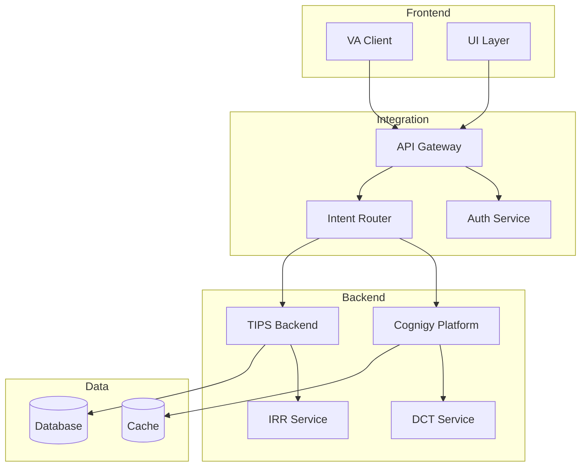

````markdown
# Diagram Generation Standards - VA Project

**Priority**: HIGH
**Applies to**: All Mermaid diagrams in VA documentation
**Tools**: mermaid-cli (mmdc), renderMermaidDiagram
**Last Updated**: February 24, 2026

---

## Purpose

Ensure all VA project diagrams are crisp, readable, and maintain quality when zoomed. Complex architecture diagrams with many components require higher resolution to remain legible in both digital and print formats.

---

## Core Requirements

### 1. Resolution Standards

**Default Scale**: **2x** (double resolution)
**Applies to**: All Mermaid diagrams in VA documentation

**Rationale**:
- Text readability: Small labels become fuzzy at 1x scale when zoomed
- Future-proofing: High-DPI displays require higher resolution
- Print quality: 2x scale ensures crisp output when converted to Word/PDF
- Minimal file size impact: PNG compression keeps files reasonable

### 2. Complexity-Based Scaling

For VA architecture diagrams:

| Complexity | Criteria | Scale Factor | Example |
|------------|----------|--------------|---------|
| **Low** | ≤5 nodes, simple flow | 2x | Basic user flow |
| **Medium** | 6-15 nodes, moderate branching | 2x | API integration diagram |
| **High** | 16+ nodes, many connections | 3x | Complete VA architecture |

**VA-Specific Complexity Indicators**:
- Integration diagrams with Cognigy + TIPS + DCT = High
- Simple API endpoint flows = Low  
- Component interaction diagrams = Medium

---

## Implementation Guidelines

### A. Mermaid CLI (mmdc)

When using `@mermaid-js/mermaid-cli`:

```bash
# Standard 2x resolution (REQUIRED for VA diagrams)
mmdc -i VA_Architecture_diagram_01.mmd -o VA_Architecture_diagram_01.png -s 2 -b transparent

# High complexity VA architecture (optional 3x)
mmdc -i VA_Complete_Integration_diagram_01.mmd -o VA_Complete_Integration_diagram_01.png -s 3 -b transparent
```

**Parameters**:
- `-i` : Input Mermaid file (.mmd)
- `-o` : Output PNG file
- `-s 2` or `-s 3`: Scale factor (2x or 3x)
- `-b transparent`: Transparent background for document embedding

**Optional parameters**:
- `-w 1920` : Fixed width in pixels
- `-H 1080` : Fixed height in pixels
- `-t default` : Theme (default, dark, forest, neutral)

---

### B. PowerShell Script for VA Diagrams

Create `Generate-VA-Diagrams.ps1`:

```powershell
<#
.SYNOPSIS
Generate PNG diagrams from Mermaid source files for VA documentation.

.PARAMETER Scale
Scale factor for PNG generation (2 or 3). Default: 2

.PARAMETER Force
Regenerate all diagrams even if PNG already exists.

.EXAMPLE
.\Generate-VA-Diagrams.ps1
Generate all diagrams at 2x resolution

.EXAMPLE
.\Generate-VA-Diagrams.ps1 -Scale 3 -Force
Regenerate all diagrams at 3x resolution
#>

param(
    [Parameter(Mandatory=$false  )]
    [ValidateSet(2, 3)]
    [int]$Scale = 2,
    
    [Parameter(Mandatory=$false)]
    [switch]$Force
)

Write-Host "Generating VA Documentation Diagrams" -ForegroundColor Cyan
Write-Host "=====================================" -ForegroundColor Cyan
Write-Host "Scale Factor: ${Scale}x" -ForegroundColor White
Write-Host ""

# Find all .mmd files in documentation directory
$mmdFiles = Get-ChildItem -Path "documentation" -Recurse -Filter "*.mmd"

if ($mmdFiles.Count -eq 0) {
    Write-Host "No Mermaid source files found." -ForegroundColor Yellow
    exit 0
}

Write-Host "Found $($mmdFiles.Count) Mermaid source file(s)" -ForegroundColor Green
Write-Host ""

$generated = 0
$skipped = 0
$failed = 0

foreach ($mmd in $mmdFiles) {
    $pngFile = $mmd.FullName -replace '\.mmd$', '.png'
    $relativePath = $mmd.FullName -replace [regex]::Escape($PWD), '.'
    
    Write-Host "Processing: $relativePath" -ForegroundColor Yellow
    
    # Check if PNG exists and Force not specified
    if ((Test-Path $pngFile) -and -not $Force) {
        Write-Host "  → PNG exists, skipping (use -Force to regenerate)" -ForegroundColor Gray
        $skipped++
        continue
    }
    
    try {
        # Generate PNG at specified scale
        $result = & mmdc -i $mmd.FullName -o $pngFile -s $Scale -b transparent 2>&1
        
        if ($LASTEXITCODE -eq 0) {
            $pngSize = (Get-Item $pngFile).Length
            $pngSizeKB = [math]::Round($pngSize / 1KB, 1)
            Write-Host "  ✅ Generated: $pngSizeKB KB" -ForegroundColor Green
            $generated++
        } else {
            Write-Host "  ❌ Failed: $result" -ForegroundColor Red
            $failed++
        }
    } catch {
        Write-Host "  ❌ Error: $_" -ForegroundColor Red
        $failed++
    }
    
    Write-Host ""
}

Write-Host "Summary" -ForegroundColor Cyan
Write-Host "-------" -ForegroundColor Cyan
Write-Host "Generated: $generated" -ForegroundColor Green
Write-Host "Skipped:   $skipped" -ForegroundColor Gray
Write-Host "Failed:    $failed" -ForegroundColor $(if ($failed -gt 0) { "Red" } else { "Green" })
```

**Usage**:
```powershell
# Generate all VA diagrams at 2x (default)
.\Generate-VA-Diagrams.ps1

# Force regenerate at 3x for high complexity
.\Generate-VA-Diagrams.ps1 -Scale 3 -Force
```

---

### C. GitHub Copilot Integration

When generating Mermaid diagrams via `renderMermaidDiagram` tool:

- Tool automatically generates at appropriate resolution
- No explicit scale parameter needed
- Result should be 2x minimum

If manual generation needed:
1. Create .mmd file with Mermaid code
2. Use mmdc command with `-s 2` parameter
3. Verify PNG quality

---

## Verification Checklist

✅ **PNG Resolution**: Check image dimensions (should be 2x or 3x base size)
✅ **File Size**: PNG files typically 50-500 KB depending on complexity
✅ **Visual Quality**: Zoom to 200% in image viewer, text should be sharp
✅ **Word Embedding**: Images display clearly in converted .docx files
✅ **Both Files Present**: Every diagram has both .png and .mmd files

**PowerShell verification script**:
```powershell
# Check all VA diagrams meet minimum resolution
Get-ChildItem documentation -Recurse -Filter "*.png" | ForEach-Object {
    $img = [System.Drawing.Image]::FromFile($_.FullName)
    $relativePath = $_.FullName -replace [regex]::Escape($PWD), '.'
    
    if ($img.Width -lt 1000) {
        Write-Host "⚠️  LOW RESOLUTION: $relativePath - $($img.Width)x$($img.Height)" -ForegroundColor Yellow
    } else {
        Write-Host "✅ OK: $relativePath - $($img.Width)x$($img.Height)" -ForegroundColor Green
    }
    $img.Dispose()
}
```

---

## VA Project-Specific Examples

### Simple Integration Flow (2x)


**Command**: `mmdc -i simple_flow.mmd -o simple_flow.png -s 2 -b transparent`
**Expected size**: ~100-150 KB

### Complex Architecture (3x recommended)


**Command**: `mmdc -i va_architecture.mmd -o va_architecture.png -s 3 -b transparent`
**Expected size**: ~300-500 KB

---

## Troubleshooting

### "Diagrams still blurry in Word"

**Check**:
1. Verify mmdc command includes `-s 2` or `-s 3`
2. Confirm PNG files were regenerated (check file timestamps)
3. Clear Word image cache: Close Word, delete %TEMP%\Word* folders
4. Regenerate Word document:
   ```powershell
   # If pandoc-defaults/docx.yaml exists:
   pandoc VA-Doc.md -o VA-Doc.docx -d pandoc-defaults/docx.yaml --resource-path=diagrams
   
   # Portable method (no config file needed):
   pandoc -f markdown -t docx -o VA-Doc.docx VA-Doc.md --resource-path=diagrams
   ```

**Fix**: Delete and regenerate
```powershell
Remove-Item documentation\**\diagrams\*.png -Force
.\Generate-VA-Diagrams.ps1 -Scale 2 -Force
```

---

### "File sizes too large"

**Typical sizes** (VA diagrams at 2x):
- Simple flow (≤5 nodes): 50-150 KB
- Medium architecture (6-15 nodes): 150-300 KB  
- Complex system (16+ nodes): 300-500 KB

**If exceeding 1 MB**:
- Check for unnecessary whitespace in Mermaid code
- Optimize PNG: `pngquant diagram.png --quality 80-100 --output diagram-opt.png`
- Consider simplifying diagram (break into multiple smaller diagrams)

---

### "mmdc command not found"

**Install mermaid-cli globally**:
```bash
npm install -g @mermaid-js/mermaid-cli
```

**Verify installation**:
```powershell
mmdc --version
# Should show: @mermaid-js/mermaid-cli 10.x.x or higher
```

**Alternative**: Use online tool [mermaid.live](https://mermaid.live/), download PNG at 2x scale manually

---

## Integration with Other Standards

### UTF-8 Encoding
- Mermaid source files must use UTF-8 encoding
- See [utf8-encoding-standards.md](utf8-encoding-standards.md)

### Mermaid Diagram Standards
- Follow clean syntax rules (no inline styles)
- See [mermaid-diagram-standards.md](mermaid-diagram-standards.md)

### Document Styles
- PNG references use markdown format: ``
- See [document-styles.md](document-styles.md)

---

**This standard ensures all VA project diagrams maintain professional quality across all output formats.**

````