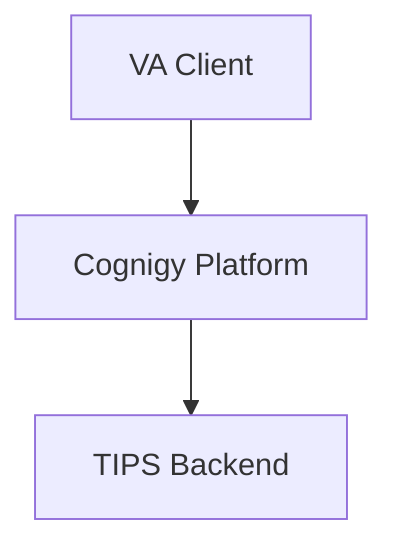
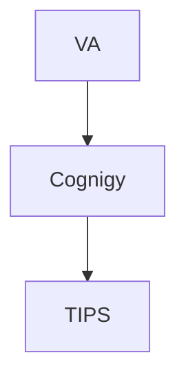

````markdown
# Document Formatting and Style Standards - VA Project

**Skill Type:** Documentation Standards  
**Scope:** Project-wide  
**Applies To:** All technical documentation for iCompass VA Integration Architecture  
**Created:** February 24, 2026  

---

## Prerequisites

⚠️ **CRITICAL:** Before applying these style standards, ensure UTF-8 encoding is correct.

**See:** `utf8-encoding-standards.md`

All VA documents MUST use UTF-8 encoding without BOM. Garbled characters (â†', ✅, âŒ) indicate encoding corruption that must be fixed before applying formatting standards.

---

## Rule 1: Table of Contents (TOC) Insertion

### Objective

Provide clear navigation for complex VA documentation by automatically generating and inserting a Table of Contents.

### Standards

**WHEN:** Document has sufficient complexity requiring navigation aid

**THEN:** Insert Table of Contents with:
1. Bold title: **Table of Contents**
2. Horizontal line immediately after title
3. Hierarchical list of sections with proper indentation
4. Place TOC after document title/metadata and before first content section

**Complexity Threshold for VA Docs:**
- Documents with 5+ top-level sections (H1/H2)
- Documents exceeding 1000 lines
- Architecture specifications
- API documentation with multiple endpoints
- Integration guides with multiple components
- Meeting packages with multiple topics

**DO NOT INSERT TOC:**
- Simple meeting notes (single topic)
- Executive summaries  
- Short status reports
- Documents with <5 major sections

### Format

**Markdown:**
```markdown
# iCompass VA Cognigy Integration Architecture

**Project**: VA Integration
**Date**: 2026-02-24
**Status**: Active

**Table of Contents**

---

1. [Overview](#overview)
   1. [Purpose](#purpose)
   2. [Scope](#scope)
2. [Architecture](#architecture)
   1. [Components](#components)
   2. [Integration Points](#integration-points)
3. [API Specifications](#api-specifications)
4. [Data Flow](#data-flow)
5. [Security](#security)

---

## 1. Overview
Content...
```

**Word/PDF:** Pandoc automatically generates TOC from markdown structure using `--toc` flag.

### Examples for VA Documentation

**Complex Document (INSERT TOC):**
- iCompass VA Integration Architecture (10+ sections covering Cognigy, TIPS, DCT, IRR)
- Cognigy API Reference (multiple endpoints, authentication, data models)  
- TIPS Integration Meeting Package (agenda, decisions, technical details, action items)

**Simple Document (SKIP TOC):**
- Weekly status update (1-2 pages)
- Meeting recap notes (single meeting summary)
- Quick technical memo

---

## Rule 2: Horizontal Line Placement

### Objective

Improve visual document structure and readability by inserting horizontal lines after major sections.

### Standards

**Insert horizontal line (`---`) after:**

1. **H1 sections (always):** Major document divisions require clear visual separation
2. **H2 sections (conditional):** Insert based on document complexity and section density

**Decision Criteria for H2 Lines:**
- **Insert if:** Document has 10+ H2 sections, or H2 sections are lengthy (>500 lines each)
- **Skip if:** Document is compact, or H2 sections are short (<100 lines each)

**DO NOT insert horizontal lines:**
- Within paragraphs or text blocks
- Between H3/H4/H5 subsections (excessive visual clutter)
- In lists, tables, or code blocks
- In meeting notes with short sections

### Format

```markdown
## 1. Architecture Overview (H1)

The iCompass VA integration architecture consists of...

### 1.1. Components

Key components include Cognigy, TIPS, DCT...

---

## 2. Integration Points (H1)

The system integrates through...

---
```

### Balanced Reasoning for VA Docs

**High Complexity Document (H1 + H2 lines):**
- Document: iCompass VA Integration Architecture
- Sections: 8 major components, each with 5+ subsections
- Decision: Insert lines after both H1 and H2 (clear visual hierarchy needed)

**Medium Complexity Document (H1 lines only):**
- Document: Cognigy API Specification
- Sections: 6 major API groups, moderate endpoint density
- Decision: Insert lines after H1 only (sufficient visual separation)

**Low Complexity Document (minimal lines):**
- Document: Meeting Recap 2026-02-16
- Sections: 3-4 sections (Attendees, Discussion, Decisions, Actions)
- Decision: Minimal or no horizontal lines (flows naturally)

---

## Rule 3: Vertical Compactness

### Objective

Maximize information density and reduce unnecessary whitespace while maintaining readability in VA documentation.

### Standards

**Avoid inserting blank lines:**
- Between section headers and content
- Between consecutive list items
- Between table rows
- Between consecutive paragraphs (use single line break only)
- Between related decision points or action items

**DO insert blank lines when:**
- Separating major logical blocks (e.g., architecture diagram from explanation)
- Before/after tables (single blank line for readability)
- Before/after code blocks or API examples
- Between different meeting topics

**Visual Necessity Test:**
Ask: "Does removing this blank line harm readability or create ambiguity?"
- If NO → Remove blank line
- If YES → Keep blank line

### Examples for VA Documentation

**❌ EXCESSIVE WHITESPACE (Avoid):**
```markdown
## Integration Architecture


The VA client connects to Cognigy platform...


### Cognigy Platform


Cognigy provides conversational AI capabilities...


```

**✅ COMPACT FORMAT (Preferred):**
```markdown
## Integration Architecture

The VA client connects to Cognigy platform which provides conversational AI capabilities integrated with TIPS backend.

### Cognigy Platform

Cognigy provides conversational AI capabilities including:
- Natural language understanding
- Dialog management
- Intent routing to TIPS
```

**✅ APPROPRIATE SPACING (Architecture Diagrams):**
```markdown
### System Architecture




**Legend:**

- **VA Client**: iCompass Virtual Assistant frontend
- **Cognigy Platform**: Conversational AI engine
- **TIPS Backend**: Transaction Integration Processing System

The architecture follows...
```

### Benefits

1. **Reduced document length:** 10-20% shorter VA documents without content loss
2. **Faster scanning:** Less scrolling, more content visible per screen
3. **Professional appearance:** Consistent, clean formatting
4. **Print efficiency:** Fewer pages for stakeholder reviews

---

## Application Guidelines for VA Documents

### Document Type Standards

| **Document Type** | **TOC** | **H1 Lines** | **H2 Lines** | **Compactness** |
|-------------------|---------|--------------|--------------|-----------------|
| **Architecture Spec** | ✅ Yes | ✅ Always | ✅ Yes | ✅ High |
| **API Documentation** | ✅ Yes | ✅ Always | ✅ Yes | ✅ High |
| **Integration Guide** | ✅ Yes | ✅ Always | ⚠️ Conditional | ✅ Medium |
| **Meeting Package** | ✅ Yes | ✅ Always | ⚠️ Conditional | ✅ Medium |
| **Technical Design** | ✅ Yes | ✅ Always | ✅ Yes | ✅ High |
| **Meeting Recap** | ❌ No | ⚠️ Minimal | ❌ No | ✅ Medium |
| **Status Report** | ❌ No | ⚠️ Minimal | ❌ No | ✅ High |
| **Executive Summary** | ❌ No | ❌ No | ❌ No | ✅ High |

---

## VA-Specific Formatting Rules

### Meeting Documentation

**Format:**
```markdown
# TIPS Integration Meeting - 2026-02-16

**Attendees**: [List]
**Date**: 2026-02-16
**Duration**: 60 minutes

---

## Agenda

1. Architecture review
2. API specifications
3. Integration timeline

---

## Discussion

### 1. Architecture Review

[Compact paragraphs, no excessive spacing]

### 2. API Specifications

[Compact paragraphs]

---

## Decisions

- ✅ Adopt Cognigy for conversational AI
- ✅ Use TIPS REST API for backend integration
- ❌ Defer DCT implementation to Phase 2

---

## Action Items

| Owner | Action | Due Date |
|-------|--------|----------|
| Team A | Complete API spec | 2026-03-01 |
| Team B | Deploy test environment | 2026-02-28 |
```

### Architecture Documentation

**Format:**
```markdown
# iCompass VA Integration Architecture

**Version**: 1.0
**Date**: 2026-02-24
**Status**: Active

**Table of Contents**

---

1. [Overview](#overview)
2. [Architecture](#architecture)
3. [Components](#components)
4. [Integration](#integration)

---

## 1. Overview

[Compact introduction]

### 1.1. Purpose

[Purpose statement]

### 1.2. Scope

[Scope definition]

---

## 2. Architecture




**Legend:**
- **VA**: Virtual Assistant
- **Cognigy**: Conversational AI
- **TIPS**: Backend system

### 2.1. Components

[Component descriptions in compact format]

---
```

### API Documentation

**Format:**
```markdown
# Cognigy API Specification

**Version**: 2.0
**Base URL**: https://api.cognigy.ai/v2

**Table of Contents**

---

1. [Authentication](#authentication)
2. [Endpoints](#endpoints)
3. [Data Models](#data-models)

---

## 1. Authentication

All API requests require Bearer token authentication.

**Header:**
```
Authorization: Bearer {token}
```

---

## 2. Endpoints

### 2.1. Send Message

**POST /sessions/{sessionId}/messages**

**Request:**
```json
{
  "text": "User message",
  "data": {}
}
```

**Response:**
```json
{
  "output": "Bot response",
  "data": {}
}
```

---
```

---

## Quality Checklist

Before finalizing any VA document:

- [ ] UTF-8 encoding verified (no garbled characters)
- [ ] TOC inserted for complex documents (5+ sections)
- [ ] Horizontal lines after H1 sections
- [ ] H2 lines only if document is complex (10+ H2 sections)
- [ ] Vertical spacing minimized (compact format)
- [ ] Diagrams properly embedded with legends
- [ ] Tables formatted consistently
- [ ] Code blocks properly tagged with language
- [ ] Consistent heading hierarchy
- [ ] No trailing whitespace

---

## Integration with Other Standards

This skill works in conjunction with:
- **utf8-encoding-standards.md** - Must be applied FIRST
- **mermaid-diagram-standards.md** - Diagram formatting
- **diagram-generation-standards.md** - PNG resolution
- **demo-creation-standards.md** - Demo document formatting

**Priority Order:**
1. UTF-8 Encoding - MUST be correct first
2. Document Styles - Apply formatting standards
3. Diagram Standards - Insert and format diagrams
4. Final Review - Quality checklist

---

**This standard applies to all VA project documentation to ensure consistency and professional presentation.**

````