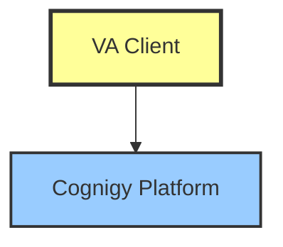
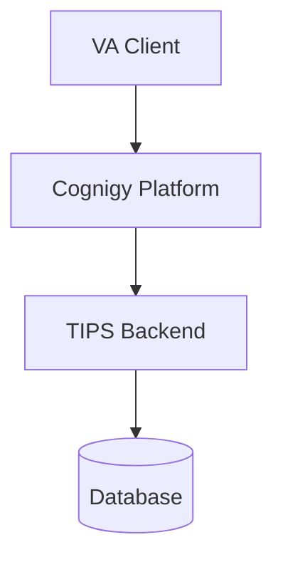
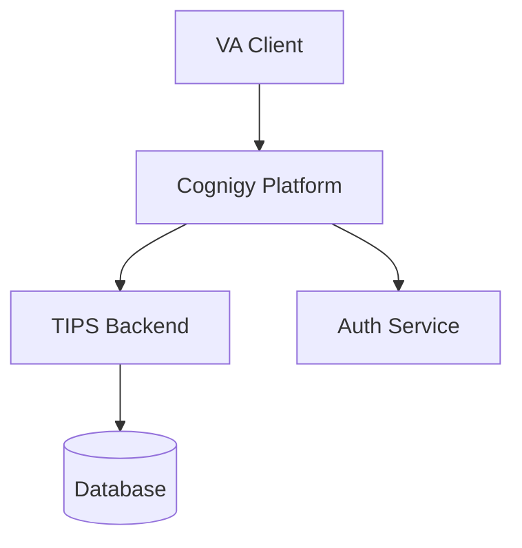
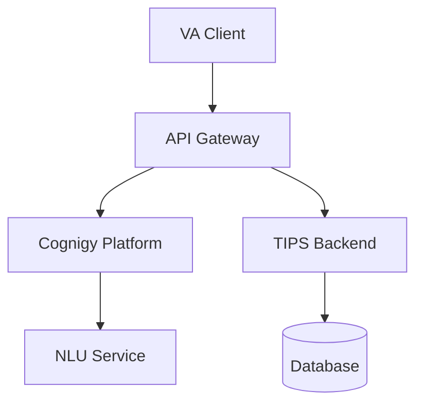
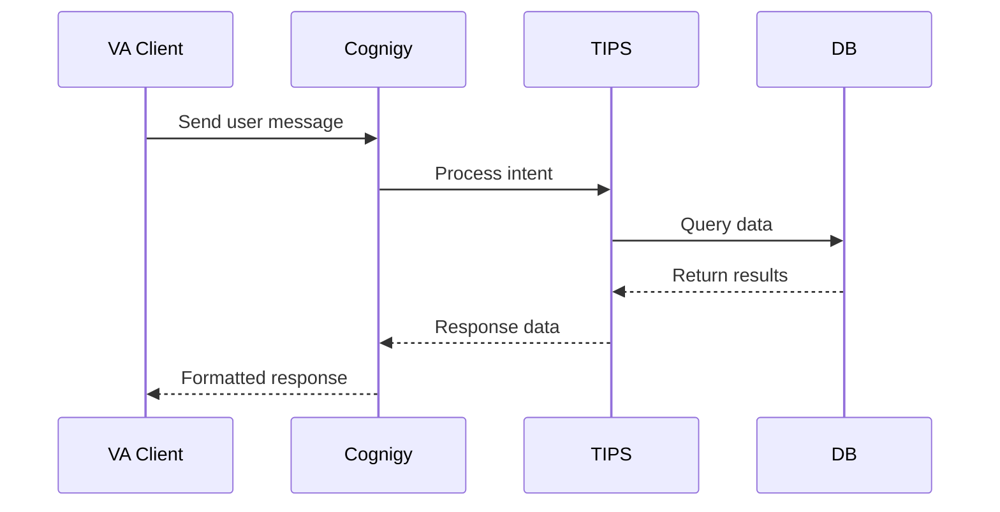
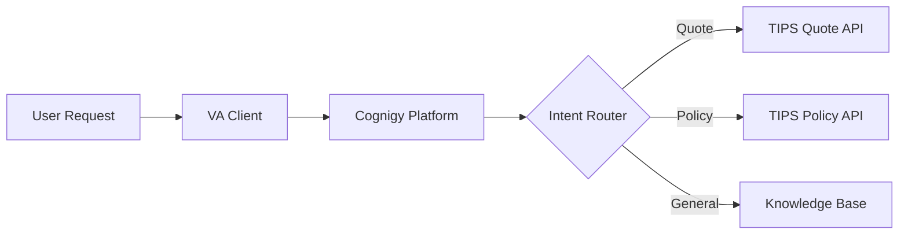

````markdown
# Mermaid Diagram Standards for VA Documentation

**Skill Type:** Documentation Standards  
**Scope:** Project-wide  
**Applies To:** All technical documentation containing diagrams  
**Created:** February 24, 2026  

---

## Rule: Mermaid Diagram Rendering and Formatting

### Objective

Ensure all Mermaid diagrams in VA project documentation are:
1. Rendered as PNG images in Word documents
2. Free of inline style directives that clutter the output
3. Simple, clean, and text-focused
4. Properly labeled with legends

---

## Standards

### 1. Style Directives Removal

**❌ DON'T USE: Inline style directives**


**✅ DO USE: Clean, text-only diagrams**


**Rationale:** Inline style directives get rendered literally in Word documents, creating visual clutter. Keep diagrams simple and let the rendering engine handle default styling.

---

### 2. PNG Generation and Insertion for Word/PDF Documents

**RULE: Automatic Visual Representation**

**WHEN:** A Mermaid diagram is present in VA documentation

**THEN:** 
1. Generate PNG image of the diagram at 2x resolution
2. Store PNG and .mmd source in `diagrams/` subdirectory
3. Insert PNG image ABOVE the Mermaid code block
4. Keep Mermaid code block in markdown for maintainability
5. Include legend immediately after diagram

**Example Structure:**
```
documentation/OUT-DESIGN/
├── VA-Cognigy-Technical-Architecture.md (contains Mermaid blocks)
├── VA-Cognigy-Technical-Architecture.docx (contains PNG images)
└── diagrams/
    ├── VA_Cognigy_Technical_Architecture_diagram_01.png
    ├── VA_Cognigy_Technical_Architecture_diagram_01.mmd
    ├── VA_Cognigy_Technical_Architecture_diagram_02.png
    └── VA_Cognigy_Technical_Architecture_diagram_02.mmd
```

---

### 3. Diagram File Naming Convention

**Standard format**:
```
{DocumentName}_diagram_{NN}.png
{DocumentName}_diagram_{NN}.mmd
```

**Examples**:
- `VA_Integration_Architecture_diagram_01.png`
- `VA_Integration_Architecture_diagram_01.mmd`
- `Cognigy_API_Specification_diagram_01.png`
- `Cognigy_API_Specification_diagram_01.mmd`
- `TIPS_Integration_Design_diagram_02.png`
- `TIPS_Integration_Design_diagram_02.mmd`

**Numbering**: Use zero-padded numbers (01, 02, 03, ..., 10, 11, ...)

---

### 4. Markdown Format with Legends

**In Markdown files (`.md`):**

```markdown
### System Architecture




**Legend:**

- **VA Client**: iCompass Virtual Assistant frontend
- **Cognigy Platform**: Conversational AI engine
- **TIPS Backend**: Transaction Integration Processing System
- **Database**: Persistent data storage
- **Auth Service**: Authentication and authorization

**Mermaid source:** diagrams/VA_Integration_Architecture_diagram_01.mmd
```

**Key Elements:**
1. PNG image reference with descriptive alt text
2. Mermaid code block (for maintainability)
3. Legend section explaining all components
4. Mermaid source file reference

---

### 5. Legend Requirements

**MANDATORY:** Every diagram must include a legend immediately after the diagram.

**Format:**
```markdown
**Legend:**

- **Component Name**: Description of component
- **Another Component**: Its purpose and role
```

**Legend Guidelines:**
- Insert blank line between "Legend:" and first list item
- Explain ALL nodes, abbreviations, and symbols used in diagram
- Be specific to VA project components
- Include integration points and data flows if relevant

**Common VA Components to Explain:**
- **VA / iCompass VA**: Virtual Assistant platform
- **Cognigy**: Conversational AI platform
- **TIPS**: Backend integration system
- **DCT**: Document/Content transformation
- **IRR**: Integration requirements repository
- **Auth**: Authentication service
- **API Gateway**: Entry point for API requests

---

### 6. Implementation Steps

When creating or updating VA documentation:

1. **Write Mermaid diagrams without style directives**
   - Use only structural elements (nodes, edges, labels)
   - Avoid: `style`, `fill`, `stroke`, `stroke-width`, `color`, `classDef`, `class` assignments

2. **Save Mermaid source to .mmd file**
   - Store in `diagrams/` subdirectory
   - Use proper naming convention

3. **Generate PNG images**
   - Use `renderMermaidDiagram` tool OR
   - Use mermaid-cli: `mmdc -i diagram.mmd -o diagram.png -s 2 -b transparent`
   - Verify image clarity (800-1200px width optimal)

4. **Update markdown with PNG reference**
   - Insert `` above Mermaid block
   - Keep Mermaid code block for maintainability
   - Add legend immediately after

5. **Reference Mermaid source**
   - Add line: `Mermaid source: diagrams/filename.mmd`

6. **Regenerate Word documents**
   - Run Pandoc (portable method): `pandoc -f markdown -t docx -o output.docx input.md --resource-path=diagrams`
   - Run Pandoc (with custom styling): `pandoc -f markdown -t docx -o output.docx input.md -d pandoc-defaults/docx.yaml --resource-path=diagrams` *(requires config file)*
   - Verify PNG images appear correctly in Word
   - Check legend formatting

**Path Resolution Note:**

If markdown file is in subdirectory and references diagrams in sibling directory (e.g., `../diagrams/file.png`), use:
```powershell
pandoc -f markdown -t docx -o output.docx input.md --resource-path=".."
```

See [Diagram Generation Standards - Troubleshooting](diagram-generation-standards.md#troubleshooting) for detailed path resolution examples.

---

### 7. Prohibited Directives

**Remove these from all VA Mermaid diagrams:**
- `style <node> fill:#xxx`
- `style <node> stroke:#xxx`
- `style <node> stroke-width:Npx`
- `classDef <name> fill:#xxx,stroke:#xxx`
- `class <node> <className>`
- Custom CSS or styling properties

---

### 8. Common VA Diagram Types

#### Architecture Diagram


#### Sequence Diagram


#### Integration Flow


---

### 9. Benefits

1. **Clean output:** No style code clutter in generated Word documents
2. **Consistency:** Uniform diagram appearance across all VA documents
3. **Maintainability:** Simpler Mermaid code, easier to update
4. **Portability:** PNG images work across all platforms and viewers
5. **Professional appearance:** Clean, readable diagrams for stakeholders
6. **Clarity:** Legends ensure understanding of all components

---

### 10. Tools

- **Rendering:** GitHub Copilot `renderMermaidDiagram` tool
- **Conversion:** Pandoc for Markdown → Word conversion
- **Command-line:** mermaid-cli (mmdc) for batch generation
- **Validation:** Visual inspection of generated Word documents

---

### 11. Quality Checklist

Before finalizing any VA document with diagrams:

- [ ] All Mermaid blocks free of style directives
- [ ] PNG images generated at 2x resolution
- [ ] Both .png and .mmd files exist in diagrams/
- [ ] PNG referenced above Mermaid block
- [ ] Legend provided for each diagram
- [ ] Legend explains all VA-specific components
- [ ] Mermaid source file referenced
- [ ] Word document displays diagrams correctly
- [ ] Diagrams readable at 150-200% zoom

---

**This standard applies to all VA project documentation containing diagrams.**

````