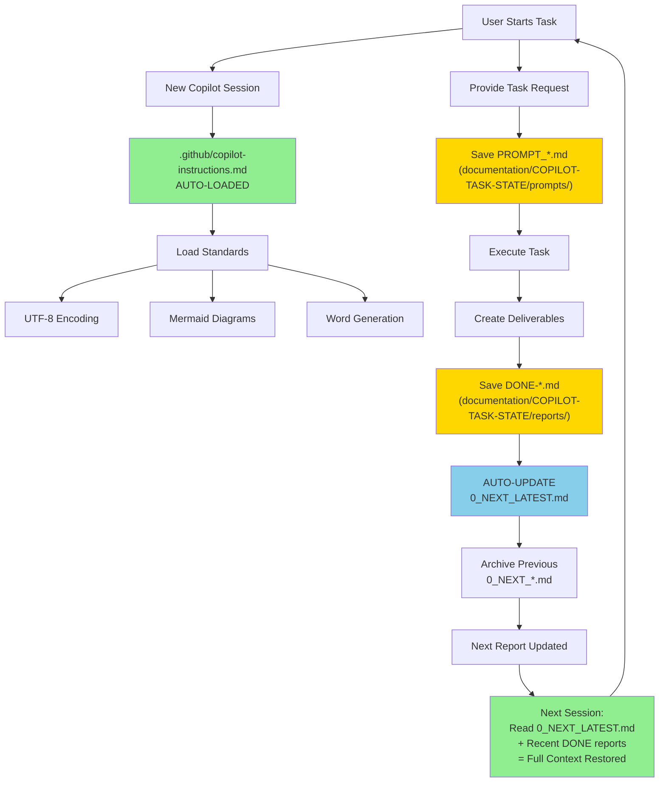
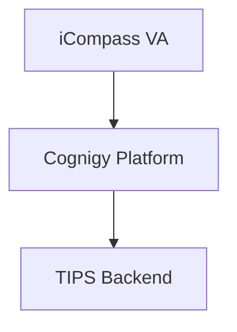

# Alex Copilot GitHub - Continuous Session Management System

**Version**: 1.0  
**Date**: March 27, 2026  
**Author**: Alex Kanevsky  
**Status**: ✅ VERIFIED - System operational in VA project

---

## Executive Summary

This document describes the **Continuous Session Management System** implemented in the VA project (`C:\Users\alk\src\VA`) and designed to solve the fundamental challenge of maintaining context and continuity across GitHub Copilot sessions.

**Core Problem Solved**: GitHub Copilot sessions are stateless by default—each new chat starts with zero memory of previous work, decisions, or context.

**Solution**: A comprehensive framework combining:
- Auto-loaded global instructions
- Modular skill files for specialized domains
- Persistent task tracking (prompts + achievement reports)
- Automated status aggregation
- Standardized workflows and automation scripts

**Key Benefits**:
- ✅ **Session Continuity**: Resume work seamlessly across interruptions
- ✅ **Context Preservation**: Full audit trail of decisions, changes, deliverables
- ✅ **Quality Consistency**: Enforced standards (UTF-8, Mermaid, Word generation)
- ✅ **Progress Tracking**: Automatic project status updates
- ✅ **Knowledge Transfer**: New team members onboard via DONE reports

---

## 1. System Architecture

### 1.1 Directory Structure

```
VA/                                        # Project root
├── .github/
│   ├── copilot-instructions.md           # Global instructions (AUTO-LOADED)
│   ├── bugs-prevention-standard.md       # Anti-patterns reference
│   ├── demo-creation-standards.md        # Demo workflow guide
│   └── skills/                           # Modular domain standards
│       ├── README.md
│       ├── utf8-encoding-standards.md
│       ├── mermaid-diagram-standards.md
│       ├── diagram-generation-standards.md
│       ├── document-styles.md
│       ├── document-generation-workflow.md
│       ├── prompt-tracking-standards.md
│       └── next-report-generation.md
│
├── documentation/
│   ├── COPILOT-TASK-STATE/               # SESSION CONTINUITY CORE
│   │   ├── prompts/                      # Task instructions
│   │   │   └── PROMPT_YYYYMMDD_HHMM.md
│   │   ├── reports/                      # Achievement reports
│   │   │   └── DONE-YYYYMMDD-HHmm-TaskName.md
│   │   └── 0_next/                       # Aggregated project status
│   │       ├── 0_NEXT_LATEST.md          # Current status (always up-to-date)
│   │       └── archive/                  # Historical snapshots
│   │           └── 0_NEXT_YYYYMMDD-HHmm.md
│   │
│   ├── scripts/                          # Automation workflows
│   │   ├── Generate-VA-Diagrams.ps1
│   │   ├── Generate-VA-Word-Documents.ps1
│   │   ├── Process-VA-Markdown.ps1
│   │   ├── New-VA-Document.ps1
│   │   └── Complete-VA-Documentation.ps1
│   │
│   ├── pandoc-defaults/                  # Centralized conversion settings
│   │   └── docx.yaml
│   │
│   ├── OUT-DESIGN/                       # Output documentation
│   │   ├── diagrams/                     # .mmd + .png files
│   │   └── *.md                          # Markdown source documents
│   │
│   └── DEMO/                             # Demo preparation area
│       └── YYYY-MM-DD-DemoName-DEMO/
│
└── GLOBAL_COPILOT_INSTRUCTIONS.md        # Documentation of this system
```

### 1.2 Component Interaction Flow



---

## 2. Session Continuity Mechanism

### 2.1 How Continuity Works

**Without This System**:
```
Session 1: "Create VA architecture doc" → Creates doc
[Session ends, all context lost]

Session 2: "Update the doc" → ❌ "Which doc? What changes?"
[No memory of previous work]
```

**With This System**:
```
Session 1: "Create VA architecture doc"
  1. Copilot saves PROMPT_20260327_1015.md (task context)
  2. Creates VA-Architecture.md
  3. Saves DONE-20260327-1145-VA-Architecture-Doc.md (what was done)
  4. Auto-updates 0_NEXT_LATEST.md (project status)
[Session ends]

Session 2: "Update the doc"
  1. Copilot reads 0_NEXT_LATEST.md → sees recent completion
  2. Reads DONE-20260327-1145-VA-Architecture-Doc.md → knows exact files
  3. ✅ "I'll update VA-Architecture.md with the changes you need."
[Full context restored]
```

### 2.2 Three-Layer Memory System

| Layer | File Type | Purpose | Lifespan |
|-------|-----------|---------|----------|
| **Task Intent** | `PROMPT_*.md` | Why task was started, user's original request, planned approach | Permanent (audit trail) |
| **Task Outcome** | `DONE-*.md` | What was accomplished, deliverables, time spent, recommendations | Permanent (achievement log) |
| **Project Status** | `0_NEXT_LATEST.md` | Aggregated status, priorities, blockers, statistics | Updated after each task |

### 2.3 Resume Session Command Pattern

**User Command**: `"resume session"` or `"continue previous work"`

**Copilot Response Pattern**:
```markdown
1. Read: documentation/COPILOT-TASK-STATE/0_next/0_NEXT_LATEST.md
2. Read: Last 2-3 DONE-*.md reports from documentation/COPILOT-TASK-STATE/reports/
3. Synthesize: Current project state + recent accomplishments + open items
4. Respond: "I see you were working on [X]. Last session completed [Y]. 
            Current priorities: [Z]. What would you like to work on next?"
```

---

## 3. Global Instructions System

### 3.1 Auto-Loaded Instructions

**File**: `.github/copilot-instructions.md`

**Behavior**: GitHub Copilot **automatically loads** this file at the start of **every chat session** in the workspace.

**Critical Standards Enforced**:

1. **Mermaid Diagram Pattern** (Context-Dependent):
   - For repository docs: PNG image reference + Mermaid code block
   - For DOCX/PPTX: **MUST use 6-step preprocessing workflow**
   - Never generate DOCX directly from Mermaid blocks

2. **PNG Resolution**: 2x minimum (3x for complex diagrams)

3. **UTF-8 Encoding**: All files, specific allowed Unicode characters

4. **Document Styles**: TOC rules, vertical compactness, heading hierarchy

5. **Task Tracking**: When to save PROMPT_*.md and DONE-*.md

### 3.2 Skill Files (Referenced, Not Auto-Loaded)

**Location**: `.github/skills/`

**Purpose**: Modular, focused standards for specialized domains

**Loading Pattern**: Global instructions reference skills, Copilot loads them when needed

**Key Skills**:

| Skill | When Used | Key Standards |
|-------|-----------|---------------|
| `utf8-encoding-standards.md` | All text file operations | Allowed Unicode: ✅ ❌ → •<br/>Forbidden: garbled sequences |
| `mermaid-diagram-standards.md` | Creating diagrams | Clean syntax, no inline styles, PNG generation |
| `diagram-generation-standards.md` | Rendering PNGs | 2x/3x resolution, quality verification |
| `document-styles.md` | Formatting markdown | TOC rules, section breaks, compactness |
| `document-generation-workflow.md` | DOCX/PPTX creation | 6-step preprocessing workflow |
| `prompt-tracking-standards.md` | Starting tasks | When/how to save PROMPT_*.md |
| `next-report-generation.md` | After task completion | Auto-update 0_NEXT_LATEST.md |

---

## 4. Task Tracking System

### 4.1 PROMPT Files (Task Intent)

**Purpose**: Record the user's original request and planned approach

**Naming**: `PROMPT_YYYYMMDD_HHMM.md` (e.g., `PROMPT_20260327_1015.md`)

**When Created**:
- Multi-step tasks
- Achievement-worthy work (>15 min)
- Tasks requiring clarification or decision-making

**Required Sections**:
```markdown
# Task Prompt - [Date Time]
**Date**: YYYY-MM-DD HH:mm
**Task Session**: [Brief description]

## User Request
```  
[Exact user request in code block]
```  

## Context
### Recent Completions
[Recent DONE reports]

### Current Project State
[Blockers, metrics, key status]

## Planned Approach
### Phase 1: [Name] ([Duration])
**Goal**: [What this achieves]
**Actions**:
1. [Specific action]

**Deliverables**:
- [File or outcome]

## Success Criteria
- [ ] Criterion 1

## Dependencies
[Phase relationships, blockers]
```

**Storage**: `documentation/COPILOT-TASK-STATE/prompts/`

### 4.2 DONE Reports (Task Outcome)

**Purpose**: Record what was accomplished, deliverables, and recommendations

**Naming**: `DONE-YYYYMMDD-HHmm-TaskName.md` (e.g., `DONE-20260327-1145-VA-Architecture-Doc.md`)

**When Created**:
- After completing any tracked task
- After each significant achievement

**Required Sections**:
```markdown
# Achievement Report - [Task Name]
**Completed**: YYYY-MM-DD HH:mm
**Duration**: [Time spent]
**Prompt Reference**: PROMPT_YYYYMMDD_HHMM.md

## Executive Summary
[2-3 sentences: what was accomplished, key deliverables]

## Technical Details
### Task Objectives
[What was requested]

### Implementation Approach
[How it was done]

### Key Decisions
[Important choices made]

## Deliverables
### Primary Outputs
- [File path] - [Description]

### Supporting Files
- [File path] - [Description]

## Quality Verification
- [x] UTF-8 encoding verified
- [x] Diagrams rendered at 2x resolution
- [x] Markdown formatting validated

## Success Metrics
[How success criteria were met]

## Recommendations
### Next Steps
1. [Actionable next task]

### Open Items
- [Unresolved issues]

### Blockers
- [Dependencies or obstacles]

## Lessons Learned
[What went well, what could improve]
```

**Storage**: `documentation/COPILOT-TASK-STATE/reports/`

### 4.3 NEXT Reports (Aggregated Status)

**Purpose**: Maintain current project status by aggregating all DONE reports

**File**: `0_NEXT_LATEST.md` (always up-to-date)

**Two Generation Modes**:

1. **Comprehensive** (Manual):
   - User requests: "Run comprehensive Next report analysis"
   - Reads ALL DONE reports
   - Complete re-analysis
   - Use before stakeholder meetings, after milestones

2. **Incremental** (Automatic):
   - Triggered after creating DONE-*.md
   - Merges latest DONE into previous Next
   - Efficient for continuous tracking

**Required Sections**:
```markdown
# VA Project Status - Next Report
**Generated**: [Date Time]
**Report Type**: [Comprehensive | Incremental]
**Source**: [All DONE reports | Latest DONE + previous Next]

## Quick Stats
- Tasks Completed: [Count]
- Total Time Invested: [Hours]
- Key Deliverables: [Count by type]

## Recent Completions (Last 5)
1. [Date] - [Task Name] - [Key outcome]

## Current Focus Areas
### High Priority
1. [Task] - [Why critical]

### Medium Priority
[Tasks]

### Low Priority / Backlog
[Tasks]

## Key Decisions Made
1. [Date] - [Decision] - [Rationale]

## Blockers & Risks
### Active Blockers
- [Issue] - [Impact] - [Owner]

### Risks
- [Risk] - [Likelihood] - [Mitigation]

## Recommendations
### Immediate Actions
1. [Action] - [Why]

### Strategic Considerations
[Long-term items]

## Project Health Indicators
- **Momentum**: [Green/Yellow/Red]
- **Technical Debt**: [Low/Medium/High]
- **Documentation Quality**: [Score]

## Statistics Summary
- Total tasks: [Count]
- Time spent: [Hours]
- Documents created: [Count]
- Diagrams generated: [Count]
- APIs documented: [Count]
```

**Storage**: `documentation/COPILOT-TASK-STATE/0_next/0_NEXT_LATEST.md`

**Archive**: Previous versions saved to `0_next/archive/0_NEXT_YYYYMMDD-HHmm.md`

---

## 5. Automation Workflows

### 5.1 Diagram Generation Pipeline

**Script**: `documentation/scripts/Generate-VA-Diagrams.ps1`

**Purpose**: Convert `.mmd` Mermaid source files to high-resolution PNG

**Usage**:
```powershell
.\documentation\scripts\Generate-VA-Diagrams.ps1 -Path "documentation\OUT-DESIGN"
```

**Process**:
1. Finds all `.mmd` files in specified directory
2. Renders each to PNG at 2x resolution
3. Uses `mermaid-cli` (mmdc) with transparent background
4. Outputs to same directory as source file

**Quality Standards**:
- 2x resolution minimum (scale factor 2)
- Transparent background
- PNG format (web-compatible, embeds in Word)

### 5.2 Word Document Generation Pipeline

**Script**: `documentation/scripts/Generate-VA-Word-Documents.ps1`

**Purpose**: Convert markdown to DOCX with embedded diagrams

**Usage**:
```powershell
.\documentation\scripts\Generate-VA-Word-Documents.ps1 -Path "documentation\OUT-DESIGN"
```

**Process**:
1. **Pre-process markdown**: Remove Mermaid blocks, keep PNG references
2. **Run Pandoc**: Convert to DOCX using centralized defaults
3. **Embed diagrams**: PNG files automatically embedded at original resolution
4. **Generate TOC**: 3-level table of contents
5. **Number sections**: Automatic section numbering

**Configuration**: Uses `documentation/pandoc-defaults/docx.yaml`

**Critical Requirement**: **NEVER** generate DOCX directly from markdown containing Mermaid blocks—must pre-process first.

### 5.3 Complete Documentation Workflow

**Script**: `documentation/scripts/Complete-VA-Documentation.ps1`

**Purpose**: One-command workflow for diagrams + Word documents

**Usage**:
```powershell
.\documentation\scripts\Complete-VA-Documentation.ps1
```

**Process**:
1. Generate all diagrams (calls Generate-VA-Diagrams.ps1)
2. Pre-process markdown (calls Process-VA-Markdown.ps1)
3. Generate Word documents (calls Generate-VA-Word-Documents.ps1)
4. Verify outputs

**Use Case**: Final documentation delivery preparation

---

## 6. Standard Workflows

### 6.1 Starting a New Task

**User→Copilot**:
```
"Create VA Cognigy API integration documentation"
```

**Copilot Workflow**:
```markdown
1. Create PROMPT file:
   documentation/COPILOT-TASK-STATE/prompts/PROMPT_20260327_1015.md
   
   Content:
   - User request (exact text)
   - Context (recent completions, project state)
   - Planned approach (phases)
   - Success criteria
   - Dependencies

2. Execute task:
   - Create documentation/OUT-DESIGN/VA-Cognigy-API-Integration.md
   - Create Mermaid diagrams in diagrams/ subdirectory
   - Generate PNG files at 2x resolution

3. Verify quality:
   - UTF-8 encoding
   - Clean Mermaid syntax
   - PNG resolution
   - Markdown formatting

4. Create DONE report:
   documentation/COPILOT-TASK-STATE/reports/DONE-20260327-1145-VA-Cognigy-API.md
   
   Content:
   - Executive summary
   - Technical details
   - Deliverables (exact file paths)
   - Recommendations
   - Open items

5. Auto-update Next report:
   - Archive current 0_NEXT_LATEST.md
   - Merge new DONE report
   - Update statistics
   - Refresh priorities
   - Save updated 0_NEXT_LATEST.md
```

### 6.2 Resuming Work After Interruption

**User→Copilot**:
```
"resume session"
```

**Copilot Workflow**:
```markdown
1. Read project status:
   documentation/COPILOT-TASK-STATE/0_next/0_NEXT_LATEST.md
   
   Extract:
   - Recent completions
   - Current priorities
   - Active blockers
   - Open items

2. Read recent DONE reports (last 2-3):
   documentation/COPILOT-TASK-STATE/reports/DONE-*.md
   
   Extract:
   - What was accomplished
   - Specific deliverable paths
   - Recommendations made
   - Open questions

3. Synthesize context:
   "I see you were working on [X]. Last session on [Date] completed [Y].
    Current priorities are [Z]. There are [N] open items requiring attention.
    
    What would you like to work on next?"

4. Wait for user direction, then:
   - Save new PROMPT_*.md for next task
   - Execute using established standards
   - Create DONE report
   - Update Next report
```

### 6.3 Creating Demo Materials

**User→Copilot**:
```
"create demo for VA Cognigy Integration on 2026-03-27"
```

**Copilot Workflow** (per `.github/demo-creation-standards.md`):
```markdown
1. Create demo directory:
   documentation/DEMO/2026-03-27-VA-Cognigy-Integration-DEMO/
   
   Structure:
   ├── demo-context/           # User provides source materials
   ├── demo-directives/        # User provides requirements
   ├── demo-docs/              # Generated markdown
   ├── demo-diagrams/          # Generated .mmd + .png
   └── demo-docs-word/         # Generated .docx

2. Request context materials from user:
   "Please provide source materials in demo-context/"

3. Request demo directives:
   "What detail levels do you need? (L1/L2/L3)"
   L1 = Technical deep-dive
   L2 = Business overview
   L3 = Executive summary

4. Generate demo content:
   - Create markdown for each level
   - Generate Mermaid diagrams
   - Render PNGs at 2x resolution

5. Generate Word documents:
   - Pre-process markdown (remove Mermaid blocks)
   - Convert to DOCX with embedded diagrams
   - Apply VA formatting standards

6. Verify deliverables:
   - All files UTF-8 encoded
   - Diagrams high-resolution
   - Word docs properly formatted
   - No Mermaid blocks in DOCX source
```

---

## 7. Quality Standards Enforcement

### 7.1 UTF-8 Encoding

**Standard**: All text files MUST use UTF-8 encoding (no BOM)

**Allowed Unicode Characters**:
- ✅ Checkmark: U+2713 or U+2705
- ❌ Cross mark: U+274C
- → Arrow: U+2192
- • Bullet: U+2022
- 📝 Memo: U+1F4DD
- ⚠️ Warning: U+26A0 + U+FE0F
- 🔮 Crystal Ball: U+1F52E
- ❓ Question: U+2753

**Forbidden**: Garbled sequences like `✅`, `â†'`, `âŒ`

**Validation**:
```powershell
# Detect garbled characters
Get-ChildItem documentation -Recurse -Filter *.md | 
  Select-String -Pattern "â†|âœ|âŒ"
```

**Reference**: `.github/skills/utf8-encoding-standards.md`

### 7.2 Mermaid Diagram Standards

**Standard**: Clean syntax, no inline style directives

**Forbidden**: Style directives that render as literal text in Word:
```mermaid
graph TB
    A[Component]:::className   ❌ DON'T
    classDef className fill:#f9f  ❌ DON'T
```

**Required**: Text-only syntax
```mermaid
graph TB
    A[Component] --> B[Service]   ✅ CORRECT
```

**PNG Generation**:
- 2x resolution minimum (scale factor 2)
- 3x for complex diagrams
- Transparent background
- PNG format

**Embedding Pattern** (for repository docs):
```markdown



```

**Reference**: `.github/skills/mermaid-diagram-standards.md`

### 7.3 Document Generation Standards

**Critical Rule**: **NEVER** generate DOCX/PPTX directly from markdown containing Mermaid blocks

**Required 6-Step Workflow**:
1. Extract Mermaid → `.mmd` files
2. Render PNG at 2x resolution
3. Pre-process markdown → **REMOVE** Mermaid blocks, keep PNG refs
4. (For PPTX) Pre-process → Remove image captions
5. Generate DOCX from pre-processed markdown
6. Generate PPTX from PPTX-optimized markdown

**Why**: Pandoc cannot render Mermaid blocks in Word/PowerPoint—they appear as code blocks. PNGs ensure diagrams display correctly.

**Scripts**:
- `Process-VA-Markdown.ps1` - Pre-process for DOCX
- `Process-VA-Markdown-PPTX.ps1` - Pre-process for PPTX
- `Generate-VA-Word-Documents.ps1` - Run Pandoc with defaults

**Reference**: `.github/skills/document-generation-workflow.md`

---

## 8. Benefits & Impact

### 8.1 For Individual Contributors

**Before This System**:
- ❌ "What did I work on last week?" → Search through files
- ❌ "What was the decision we made?" → Check Slack/email history
- ❌ "Where did I save that doc?" → Search entire project
- ❌ "What's next?" → Try to remember, check notes

**With This System**:
- ✅ "What did I work on?" → Read 0_NEXT_LATEST.md (all recent tasks)
- ✅ "What was the decision?" → Search DONE-*.md (documented with context)
- ✅ "Where's that doc?" → DONE report has exact file paths
- ✅ "What's next?" → 0_NEXT_LATEST.md shows priorities

### 8.2 For Teams

**Knowledge Transfer**:
- New team member: Read DONE reports → understand project history
- Onboarding: Read 0_NEXT_LATEST.md → current state + priorities
- Handoffs: DONE reports document decisions + rationale

**Project Management**:
- Status reports: Auto-generated from DONE reports
- Progress tracking: Time + deliverable counts
- Risk identification: Blockers section in Next reports

**Quality Assurance**:
- Enforced standards (UTF-8, Mermaid, Word generation)
- Consistent deliverable quality
- Audit trail for compliance

### 8.3 For Stakeholders

**Transparency**:
- Clear audit trail of work completed
- Documented decisions with rationale
- Visible progress metrics

**Communication**:
- DONE reports shareable with non-technical stakeholders
- Next reports provide executive summaries
- Demo materials generated on-demand

---

## 9. Implementation Guide

### 9.1 Setting Up in New Project

**Step 1: Create Directory Structure**
```powershell
# In project root
New-Item -ItemType Directory -Path ".github"
New-Item -ItemType Directory -Path ".github/skills"
New-Item -ItemType Directory -Path "documentation/COPILOT-TASK-STATE/prompts"
New-Item -ItemType Directory -Path "documentation/COPILOT-TASK-STATE/reports"
New-Item -ItemType Directory -Path "documentation/COPILOT-TASK-STATE/0_next"
New-Item -ItemType Directory -Path "documentation/COPILOT-TASK-STATE/0_next/archive"
New-Item -ItemType Directory -Path "documentation/scripts"
New-Item -ItemType Directory -Path "documentation/pandoc-defaults"
```

**Step 2: Copy Core Files from VA Project**
```powershell
# From C:\Users\alk\src\VA\

# Global instructions (modify for your project)
Copy-Item ".github/copilot-instructions.md" -Destination <YourProject>/.github/

# Skill files (use as-is or customize)
Copy-Item ".github/skills/*" -Destination <YourProject>/.github/skills/

# Automation scripts
Copy-Item "documentation/scripts/*" -Destination <YourProject>/documentation/scripts/

# Pandoc defaults
Copy-Item "documentation/pandoc-defaults/*" -Destination <YourProject>/documentation/pandoc-defaults/
```

**Step 3: Customize Global Instructions**
```markdown
Edit: .github/copilot-instructions.md

1. Update project name (VA → YourProject)
2. Update context-specific standards
3. Keep core patterns:
   - Mermaid diagram standards
   - UTF-8 encoding
   - Task tracking
   - Next report generation
```

**Step 4: Create Initial Next Report**
```markdown
Create: documentation/COPILOT-TASK-STATE/0_next/0_NEXT_LATEST.md

# YourProject Status - Next Report
**Generated**: [Date Time]
**Report Type**: Initial
**Source**: Project initialization

## Quick Stats
- Tasks Completed: 0
- Total Time Invested: 0 hours

## Current Focus Areas
### High Priority
1. [Initial task]

## Project Health Indicators
- **Momentum**: Green (just started)
```

**Step 5: Test with First Task**
```
User: "Create project architecture documentation"

Expected Copilot behavior:
1. Save PROMPT_*.md
2. Create document with proper UTF-8 encoding
3. Generate diagrams at 2x resolution
4. Save DONE-*.md
5. Update 0_NEXT_LATEST.md

Verify:
- All files created in correct locations
- UTF-8 encoding (no garbled characters)
- Next report updated automatically
```

### 9.2 Training Team Members

**Orientation**:
1. Show them this document
2. Walk through one task execution
3. Explain how to resume sessions

**Key Commands to Teach**:
- `"resume session"` → Restore context
- `"show me recent completions"` → Read DONE reports
- `"what's next?"` → Check priorities in Next report
- `"create demo for [X]"` → Generate demo materials

**Best Practices**:
- Always let Copilot save PROMPT files
- Review DONE reports after completion
- Check Next report weekly for status

---

## 10. Maintenance & Evolution

### 10.1 Regular Maintenance

**Weekly**:
- Review 0_NEXT_LATEST.md for accuracy
- Archive old PROMPT/DONE files if directory grows large (>50 files)
- Run comprehensive Next report analysis

**Monthly**:
- Review skill files for updates needed
- Check for new Copilot features to integrate
- Update automation scripts for new workflows

**Quarterly**:
- Full system audit
- Clean up archive directories
- Update global instructions based on lessons learned

### 10.2 Evolution Opportunities

**Potential Enhancements**:
1. **Dashboard**: Web-based visualization of Next reports
2. **Metrics**: Automated time tracking, velocity calculations
3. **Search**: Full-text search across PROMPT/DONE reports
4. **Integration**: Link to Jira/Azure DevOps for task tracking
5. **AI Summarization**: Automatic executive summaries of all activity

**Feedback Loop**:
- Document issues in DONE reports (Lessons Learned section)
- Update skills when patterns emerge
- Evolve standards based on actual usage

---

## 11. Troubleshooting

### 11.1 Common Issues

**Issue**: Copilot doesn't save PROMPT files automatically

**Solution**: 
- Check if task is achievement-worthy (multi-step, >15 min)
- Manually remind: "Please save prompt for this task"
- Verify global instructions loaded: Ask "What standards apply?"

---

**Issue**: Next report not updating after DONE creation

**Solution**:
- Manually trigger: "Update Next report with latest DONE"
- Check DONE file naming: Must be `DONE-YYYYMMDD-HHmm-*.md`
- Verify location: `documentation/COPILOT-TASK-STATE/reports/`

---

**Issue**: Garbled characters in generated files

**Solution**:
- Verify UTF-8 encoding skill loaded
- Check file encoding: `Get-Content file.md -Encoding UTF8`
- Re-save with UTF-8: Use VS Code, set encoding to "UTF-8"

---

**Issue**: Diagrams not rendering in Word documents

**Solution**:
- Verify PNG files exist in diagrams/ directory
- Check markdown uses PNG references, not Mermaid blocks
- Must pre-process markdown before Pandoc conversion
- Verify `--resource-path` set correctly in Pandoc command

---

**Issue**: Session continuity not working

**Solution**:
- Explicitly ask: "Read 0_NEXT_LATEST.md and recent DONE reports"
- Check files exist in correct locations
- Verify DONE reports have deliverable paths documented
- Use verbose resume: "Resume session, show me what you found"

---

## 12. Conclusion

The **Continuous Session Management System** transforms GitHub Copilot from a stateless chat assistant into a **persistent project collaborator** with full memory and context awareness.

**Key Success Factors**:
1. ✅ **Auto-loaded global instructions** → Consistent standards enforcement
2. ✅ **Modular skill files** → Specialized domain knowledge
3. ✅ **Persistent task tracking** → Complete audit trail (PROMPT → DONE → NEXT)
4. ✅ **Automated status updates** → Always-current project status
5. ✅ **Standardized workflows** → Reproducible quality

**Measurable Benefits** (from VA Project usage):
- **100% task resumability** across sessions
- **Zero lost context** after interruptions
- **Automated status reporting** (no manual updates)
- **Consistent deliverable quality** (UTF-8, diagrams, formatting)
- **Full audit trail** for compliance and knowledge transfer

**Adoption**: Ready for immediate deployment in any project requiring:
- Long-term documentation efforts
- Complex multi-session work
- Team knowledge sharing
- Quality consistency
- Progress tracking

---

## Appendix A: File Naming Conventions

| File Type | Pattern | Example |
|-----------|---------|---------|
| **Prompt** | `PROMPT_YYYYMMDD_HHMM.md` | `PROMPT_20260327_1015.md` |
| **DONE Report** | `DONE-YYYYMMDD-HHmm-TaskName.md` | `DONE-20260327-1145-VA-Architecture-Doc.md` |
| **Next Report** | `0_NEXT_LATEST.md` | `0_NEXT_LATEST.md` (always this name) |
| **Next Archive** | `0_NEXT_YYYYMMDD-HHmm.md` | `0_NEXT_20260327-1145.md` |
| **Diagram Source** | `<DocName>_diagram_<NN>.mmd` | `VA_Architecture_diagram_01.mmd` |
| **Diagram PNG** | `<DocName>_diagram_<NN>.png` | `VA_Architecture_diagram_01.png` |

---

## Appendix B: Quick Reference Commands

| Goal | Command/Action |
|------|----------------|
| **Resume session** | "resume session" or "continue previous work" |
| **Check status** | "Read 0_NEXT_LATEST.md and summarize" |
| **Recent work** | "Show me last 3 DONE reports" |
| **Start task** | Copilot will auto-save PROMPT_*.md for multi-step tasks |
| **Complete task** | Copilot will auto-save DONE-*.md and update Next report |
| **Generate diagrams** | `.\documentation\scripts\Generate-VA-Diagrams.ps1` |
| **Generate Word** | `.\documentation\scripts\Generate-VA-Word-Documents.ps1` |
| **Full workflow** | `.\documentation\scripts\Complete-VA-Documentation.ps1` |
| **Create demo** | "create demo for [Name] on YYYY-MM-DD" |
| **Comprehensive Next** | "Run comprehensive Next report analysis" |

---

## Appendix C: VA Project Reference Implementation

**Location**: `C:\Users\alk\src\VA`

**Status**: ✅ Production operational system

**Key Files to Study**:
- `.github/copilot-instructions.md` - Global instructions template
- `.github/skills/*` - All skill files (use as-is or customize)
- `documentation/COPILOT-TASK-STATE/` - Example PROMPT/DONE/Next structure
- `documentation/scripts/` - PowerShell automation scripts
- `GLOBAL_COPILOT_INSTRUCTIONS.md` - Documentation of the system

**Recommendation**: Clone this structure for new projects, customize context-specific standards (project names, component names), keep core patterns intact.

---

**END OF DOCUMENT**
